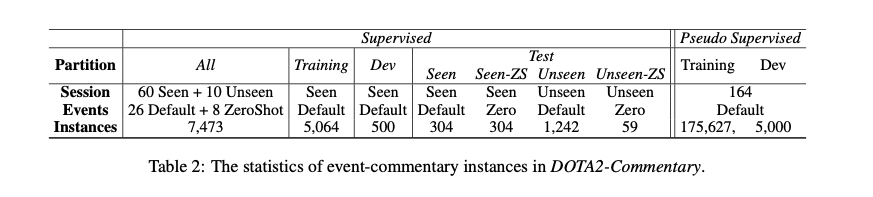

# MOBA-E2C:  Generating MOBA Game Commentaries  via Capturing Highlight Events  from the Meta-Data

The released MOBA Game Commentary Generation Dataset ``Dota2-Commentary``.

# Abstract
MOBA (Multiplayer Online Battle Arena) games such as Dota2 are currently one of the most popular e-sports gaming genres. Following professional commentaries is a great way to understand and enjoy a MOBA game. However, massive game competitions lack commentaries because of the shortage of professional human commentators. As an alternative, employing machine commentators that can work at any time and place is a feasible solution. Considering the challenges in modeling MOBA games, we propose a data-driven MOBA commentary generation framework, MOBA-E2C, allowing a model to generate commentaries based on the game meta-data. Subsequently, to alleviate the burden of collecting supervised data, we propose a MOBA-FuseGPT generator to generate MOBA game commentaries by fusing the power of a rule-based generator and a generative GPT generator. Finally, in the experiments, we take a popular MOBA game Dota2 as our case and construct a Chinese Dota2 commentary generation dataset Dota2-Commentary. Experimental results demonstrate the superior performance of our approach. To the best of our knowledge, this work is the first Dota2 machine commentator and Dota2-Commentary is the first dataset.

# Dataset


Please check the folder ``data/`` for the detail.

- in ``data/general``, we provided the data without the machine generated commentaries.
- in ``data/machine``, we provided the data with the machine generated commentaries.

for each data partition you can use the `.json` file or the linearized `.src` and `.tgt`.


# Citation

If you like this work or need to use our dataset, please use the following citation:

```
@inproceedings{DBLP:conf/emnlp/0003W0C22,
  author    = {Dawei Zhang and
               Sixing Wu and
               Yao Guo and
               Xiangqun Chen},
  editor    = {Yoav Goldberg and
               Zornitsa Kozareva and
               Yue Zhang},
  title     = {{MOBA-E2C:} Generating {MOBA} Game Commentaries via Capturing Highlight
               Events from the Meta-Data},
  booktitle = {Findings of the Association for Computational Linguistics: {EMNLP}
               2022, Abu Dhabi, United Arab Emirates, December 7-11, 2022},
  pages     = {4545--4556},
  publisher = {Association for Computational Linguistics},
  year      = {2022},
  url       = {https://aclanthology.org/2022.findings-emnlp.333},
  timestamp = {Tue, 07 Feb 2023 17:10:52 +0100},
  biburl    = {https://dblp.org/rec/conf/emnlp/0003W0C22.bib},
  bibsource = {dblp computer science bibliography, https://dblp.org}
}

```
